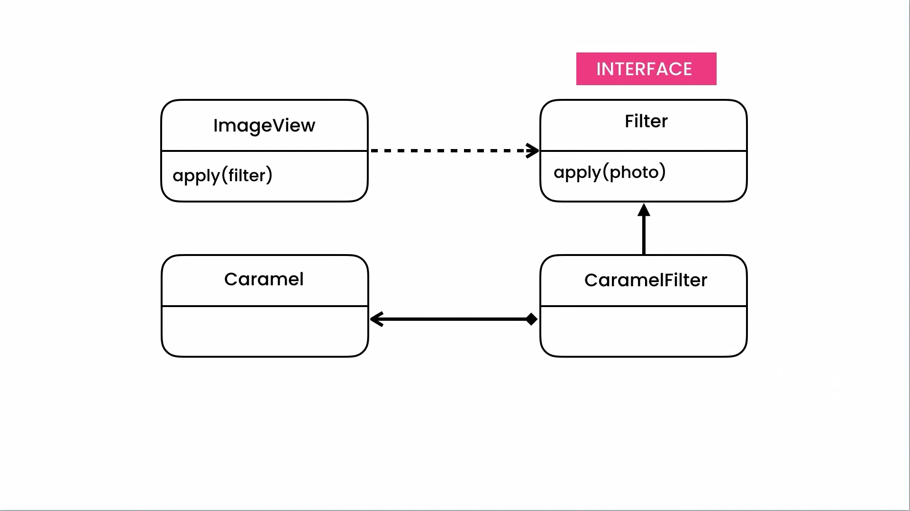

# Design Patterns

- base on `Design Patterns: Elements of Reusable Object-Oriented Software` write by GoF (Gang of four)
- 24 design pattern in 3 category: `Creational`, `Structural`, `Behavioral`
  - `Creational`: different way to create object
  - `Structural`: relationship between objects
  - `Behavioral`: interaction/commination between objects

## The Essentials

- Classes
- Interfaces - a contract that specifies the capabilities that a class should provide
- Encapsulation - bundling a data and methods to operate data and hiding the value and state
- Abstraction - reduce complexity by hiding unnecessary detail
- Inheritance
- Polymorphism - ability of object to get many difference forms
- UML - Unified Modeling Language

  - uml shape

  | Class Name                                |
  | ----------------------------------------- |
  | + Public Property <br> - Private Property |
  | + Public Method <br> - Private Method     |

  - inherit: arrow show the parent
  - composition relationship: arrow with diamond from the class to field, use directly as field
  - dependency relationship: - use in methods

- 3 type of relationship
  - inheritance
  - composition - use directly as field
  - dependency - dashed arrow - has reference to class, like injection

## Memento Pattern

best way for implementation undo

- momento: state class used like an interface
- originator: main class, use momento as state class, dependency relationship
- caretaker: list of state, with push and pop state method, composition relationship


```java
public class EditorState {
  private final content;

  public EditorState(String content) {
    this.content = content;
  }
  
  public getContent() {
    return content;
  }
}

public class Editor {
  private String content;

  public EditorState createState() {
    return new EditorState(content);
  }

  public void restore(EditorState state) {
    content = state.getState();
  }

  public setContent(String content) {
    this.content = content;
  }
  
  public getContent() {
    return content;
  }
}

public class history {
  private List<EditorState> states = new ArrayList<>();

  public void push(EditorState state) {
    states.add(state);
  }

  public EditorState pop() {
    var lastIndex = states.size() - 1;
    var lastState = states.get(lastIndex);
    states.remove(lastIndex);

    return lastState;
  }
}

public class Main {
  public static void main(String[] args) {
    var editor = new Editor();
    var history = new History();

    editor.setContent("a"); // a
    history.push(editor.createStat());

    editor.setContent("b"); // b
    history.push(editor.createStat());
    
    editor.setContent("c"); // c
    editor.restore(history.pop());// undo -> "b"
  }
}
```

## State Pattern

allow object behave different when state changes

- State - abstract class, not use directly in program, with handle methods
- Context
- Concrete states - classes inherit from State class and implement handle methods differently


```java
public interface Tool {
  void MouseUp();
  void MouseDown();
}

public class SelectionTool implements Tool {
  @override
  void MouseUp() {
    system.out.println("Selection Icon")
  }

    @override
  void MouseDown() {
    system.out.println("Draw a dashed rectangle")
  }
}

public class BrushTool implements Tool {
  @override
  void MouseUp() {
    system.out.println("Brush Icon")
  }

  @override
  void MouseDown() {
    system.out.println("Draw a line")
  }
}

public class Canvas {
  public Tool currentTool;

  void MouseUp() {
    currentTool.MouseUp();
  }

  void MouseDown(){
    currentTool.MouseDown();
  }

  public Tool getCurrentTool() { return currentTool; }
  public void setCurrentTool(Tool currentTool) { this.currentTool = currentTool; }
}

public class Main {
  public static void main(String[] args) {
    var canvas = Canvas();
    canvas.setCurrentTool(new SelectionTool());
    canvas.MouseUp(); // Selection Icon
    canvas.MouseDown(); // Draw a dashed rectangle
  }
}
```

## Iterator Pattern

- allow to implement history in different shapes

- history class only have push and pop
- iterator class as interface for implementation
- implementation in different shape


```java
public interface Iterator { // Iterator<T>
  boolean hasNext();
  String current(); // T current();
  void next();
}

public class BrowserHistory {
  private List<String> urls = new ArrayList();

  public void push(String url) { urls.add(url); }

  public String pop() {
    var lastIndex = urls.size();
    var latUrl = urls.get(lastIndex);
    urls.remove(lastUrl);

    return lastUrl;
  }

  public Iterator createIterator() {
    return new ListIterator(this)
  }

  public class ListIterator implements Iterator {
    private BrowserHistory history;
    private int index;
    public ListIterator(BrowserHistory history) {
      this.history = history;
    }

    @override
    boolean hasNext(){
      return (index < history.urls.size());
    }

    @override
    String current() {
      return history.urls.get(index);
    }

    @override
    void next() {
      index++;
    }
  }
}

public class Main {
  public static void main(String[] args) {
    var history = new BrowserHistory();
    history.push("a");
    history.push("b");
    history.push("c");

    Iterator iterator = history.createIterator();
    while(iterator.hasNext()) {
      var url = iterator.current();
      system.out.println(url);
      iterator.next();
    }
  }
}
```

## Strategy Pattern

- use when you need to choose different strategy with polymorphisms
- similar to state strategy but not depend on state


```java
public interface Compressor {
  // byte[] compressor(byte[] image);
  void compress(String fileName);
}

public class JpegCompressor implements Compressor {
  @override
  void compress(String fileName) {
    system.out.println("Compressing using JPEG")
  }
}

public class PngCompressor implements Compressor {
  @override
  void compress(String fileName) {
    system.out.println("Compressing using PNG")
  }
}

public interface Filter {
  void apply(String fileName);
}

public class BlackAndWhiteFilter implements Filter {
  @override
  void apply(String fileName) {
    system.out.println("Applying B&W filter")
  }
}

public class ImageStorage {
  // first way
  // private Compressor compressor;
  // private Filter filter;

  // public ImageStorage(Compressor compressor, Filter filter) {
  //   this.compressor = compressor;
  //   this.filter = filter;
  // }

  // public void store(String fileName) {
  //   compressor.compress(fileName);
  //   filter.apply(fileName);
  // }

  // second way
  public void store(String fileName, Compressor compressor, Filter filter) {
    compressor.compress(fileName);
    filter.apply(fileName);
  }
}


public class Main {
  public static void main(String[] args) {
    // var imageStorage = new ImageStorage(new JpegCompressor(), new BlackAndWhiteFilter());
    // imageStorage.store("a");
    var imageStorage = new ImageStorage();
    imageStorage.store("a", new JpegCompressor(), new BlackAndWhiteFilter());
  }
}
```

## Template Method Pattern

- using inheritance for preventing duplication method in classes


```java
public abstract class Task {
  public void record() {
    system.out.println("Audit");
  }
}

public abstract class Task {
  private AuditTrail auditTrail;
  
  public Task() {
    this.auditTrail = new AuditTrail();
  }

  public Task(AuditTrail auditTrail) {
    this.auditTrail = auditTrail;
  }
  
  public void execute() {
    auditTrail.record();

    doExecute();
  }

  protected abstract void doExecute(); // protect prevent it to use directly
}

public class TransferMoneyTask implements Task {
  // public TransferMoneyTask(AuditTrail auditTrail) {
  //   super(auditTrail);
  // }

  @override
  public void doExecute() {
    system.out.println("Transfer money")
  }
}

public class Main {
  public static void main(String[] args) {
    var task = new TransferMoneyTask();
    task.execute();
  }
}
```

## Command Pattern

- invoker: the class run the method
- command: interface of method
- concreteCommand: method class implement the command interface
- receiver: class determine the job/method use concreteCommand


```java
public interface Command { // Command
  public void execute();
}

public class Button { // invoker
  private String label;
  private Command command;

  public Button(Command command) {
    this.command = command;
  }

  public void click() {
    command.execute();
  }
}

public class CustomerService { // receiver
  public void addCustomer() {
    system.out.println("Add customer");
  }
}

public class AddCustomerCommand implements Command { //concreteCommand
  private CustomerService service;

  public AddCustomerCommand(CustomerService service) {
    this.service = service;
  }

  @override
  public void execute() {
    service.addCustomer();
  }
}

public class Main {
  public static void main(String[] args) {
    var service = new CustomerService();
    var command = new AddCustomerCommand(service);
    var button = new Button(command);
    button.click();
  }
}
```

### Composite Command

```java
public class CompositeCommand implements Command {
  private List<Command> commands = new ArrayList<>();

  public void add(Command command) {
    commands.add(command);
  }

  @override
  public void execute() {
    for (var command:commands)
      command.execute();
  }
}

public class Main {
  public static void main(String[] args) {
    var composite = new CompositeCommand();
    composite.add(new ResizeCommand());
    composite.add(new BlackAndWhiteCommand());
    composite.execute();
  }
}
```

### undoable command

- momento pattern sometime need a lot of snap shot, undo a command just revert a command
- undoable command is a interface that inherit from command, because some command like save can not have undo

```java
public class HtmlDocument {
  private String content;

  public void makeBold() {
    content = "<b>"+content+"</b>";
  }
}

public interface Command {
  public void execute();
}

public interface UndoableCommand extends Command {
  public void unexecute();
}

public class History {
  private Deque<UndoableCommand> commands = new ArrayDeque<>(); // double ended que

  public void push(UndoableCommand command) {
    commands.add(command);
  }

  public UndoableCommand pop() {
    commands.pop();
  }
}

public class BoldCommand implements UndoableCommand {
  private String prevContent;
  private HtmlDocument document;
  private History history;

  public BoldCommand(HtmlDocument document, History history) {
    this.document = document;
    this.history = history;
  }

  @override
  public void execute() {
    prevContent = document.getContent();
    document.makeBold();
    history.push(this)
  }
  
  @override
  public void unexecute() {
    document.setContent(prevContent);
  }
}

public class Main {
  public static void main(String[] args) {
    var history = new History();
    var document = new HtmlDocument();
    document.setContent("Hello World!");

    var boldCommand = new BoldCommand(document, history);
    boldCommand.execute();
    system.out.println(document.getContent()); // <b>Hello World!</b>

    boldCommand.unexecute();
    system.out.println(document.getContent()); // Hello World!
  }
}
```

- can define one undo method for all command

```java

public class History {
  private Deque<UndoableCommand> commands = new ArrayDeque<>(); // double ended que

  public void push(UndoableCommand command) {
    commands.add(command);
  }

  public UndoableCommand pop() {
    commands.pop();
  }

  public int size() {
    return commands.size();
  }
}

public class UndoCommand implements Command {
  private History history;
  public UndoCommand(History history) {
    this.history = history;
  }

  @override
  public void execute() {
    if(history.size() > 0)
      history.pop().unexecute();
  }
}

public class Main {
  public static void main(String[] args) {
    var history = new History();
    var document = new HtmlDocument();
    document.setContent("Hello World!");

    var boldCommand = new BoldCommand(document, history);
    boldCommand.execute();
    system.out.println(document.getContent()); // <b>Hello World!</b>

    var undoCommand = new UndoCommand(history);
    undoCommand.execute();
    system.out.println(document.getContent()); // Hello World!
  }
}
```

## Observer Pattern

change on object value effect on other object value.


```java
public interface Observer {
  void update();
}

public class SpreadSheet implements Observer {
  @override
  void update() {
    System.out.println("SpreadSheet got Notified");
  }
}

public class Chart implements Observer {
  @override
  void update() {
    System.out.println("Chart got Updated");
  }
}

public class Subject { // observable class
  private List<Observer> observers = new ArrayList<>();

  void addObserver(Observer observer) {
    observers.add(observer);
  }

  void removeObserver(Observer observer) {
    observers.remove(observer);
  }

  void notifyObserver() {
    for(var observer : observers)
      observer.update();
  }
}

public class DataSource extends Subject {
  private int value;

  public int getValue() {
    return value;
  }

  public void setValue(int value) {
    this.value = value;
    notifyObserver();
  }
}

public class Main {
  public static void main(String[] args) {
    var dataSource = new DataSource();
    var sheet1 = new SpreadSheet();
    var sheet2 = new SpreadSheet();
    var chart = new Chart();

    dataSource.addObserver(sheet1);
    dataSource.addObserver(sheet2);
    dataSource.addObserver(chart);

    dataSource.setValue(1);
    // SpreadSheet got Notified
    // SpreadSheet got Notified
    // Chart got Updated
  }
}
```

in this way only notify of changing. for sending data we have 2 way, `pull` and `push`

### Push Style

send data in update method


```java
public interface Observer {
  void update(int value);
}

public class SpreadSheet implements Observer {
  @override
  void update(int value) {
    System.out.println("SpreadSheet got Notified: " + value);
  }
}

public class Chart implements Observer {
  @override
  void update(int value) {
    System.out.println("Chart got Updated" + value);
  }
}

public class Subject { // observable class
  private List<Observer> observers = new ArrayList<>();

  void addObserver(Observer observer) {
    observers.add(observer);
  }

  void removeObserver(Observer observer) {
    observers.remove(observer);
  }

  void notifyObserver(int value) {
    for(var observer : observers)
      observer.update(value);
  }
}

public class DataSource extends Subject {
  private int value;

  public int getValue() {
    return value;
  }

  public void setValue(int value) {
    this.value = value;
    notifyObserver(value);
  }
}

public class Main {
  public static void main(String[] args) {
    var dataSource = new DataSource();
    var sheet1 = new SpreadSheet();
    var sheet2 = new SpreadSheet();
    var chart = new Chart();

    dataSource.addObserver(sheet1);
    dataSource.addObserver(sheet2);
    dataSource.addObserver(chart);

    dataSource.setValue(1);
    // SpreadSheet got Notified: 1
    // SpreadSheet got Notified: 1
    // Chart got Updated: 1
  }
}
```

### Pull Style

observer concrete class connect with subject concrete class


```java
public interface Observer {
  void update();
}

public class SpreadSheet implements Observer {
  private DataSource dataSource;

  public SpreadSheet(DataSource dataSource) {
    this.dataSource = dataSource;
  }

  @override
  void update() {
    System.out.println("SpreadSheet got Notified:" + dataSource.getValue());
  }
}

public class Chart implements Observer {
  private DataSource dataSource;

  public SpreadSheet(DataSource dataSource) {
    this.dataSource = dataSource;
  }

  @override
  void update() {
    System.out.println("Chart got Updated:" + dataSource.getValue());
  }
}

public class Subject { // observable class
  private List<Observer> observers = new ArrayList<>();

  void addObserver(Observer observer) {
    observers.add(observer);
  }

  void removeObserver(Observer observer) {
    observers.remove(observer);
  }

  void notifyObserver() {
    for(var observer : observers)
      observer.update();
  }
}

public class DataSource extends Subject {
  private int value;

  public int getValue() {
    return value;
  }

  public void setValue(int value) {
    this.value = value;
    notifyObserver();
  }
}

public class Main {
  public static void main(String[] args) {
    var dataSource = new DataSource();
    var sheet1 = new SpreadSheet();
    var sheet2 = new SpreadSheet();
    var chart = new Chart();

    dataSource.addObserver(sheet1);
    dataSource.addObserver(sheet2);
    dataSource.addObserver(chart);

    dataSource.setValue(1);
    // SpreadSheet got Notified: 1
    // SpreadSheet got Notified: 1
    // Chart got Updated: 1
  }
}
```

## Mediator Pattern

- Mediator: abstract class
- Concrete Mediator: extends from Mediator
- Colleague: interface or abstract class
- Concrete Colleague: several extend from Colleague


```java
public abstract class DialogBox { // Mediator
  public abstract void change(UIControl control);
}

public class UIControl { // Colleague
  protected DialogBox owner;

  public UIControl(DialogBox dialogBox) {
    this.owner = owner;
  }
}

public class ListBox extends UIControl { // Concrete Colleague
  private String selection;

  public ListBox(DialogBox owner) {
    super(owner);
  }

  public String getSection() {
    return section;
  }

  public void setSelection(String selection) {
    this.selection = selection;
    owner.changed(this);
  }
}

public class TextBox extends UIControl { // Concrete Colleague
  private String content;

  public TextBox(DialogBox owner) {
    super(owner);
  }

  public String getContent() {
    return section;
  }

  public void setContent(String content) {
    this.content = content;
    owner.changed(this);
  }
}

public class Button extends UIControl { // Concrete Colleague
  private boolean isEnable;

  public Button(DialogBox owner) {
    super(owner);
  }

  public String getIsEnable() {
    return section;
  }

  public void setIsEnable(boolean isEnable) {
    this.isEnable = isEnable;
    owner.changed(this);
  }
}

public class ArticlesDialogBox extends DialogBox { // Concrete Mediator
  private ListBox articleListBox = new ListBox(this);
  private TextBox titleTextBox = new TextBox(this);
  private Button saveButton = new Button(this);

  // for testing
  public void simulateUserInteraction() {
    articleListBox.setSelection("Article 1");
    system.out.println("TextBox: " + titleTextBox.getContent() + " - Button: " + saveButton.IsEnabled());

    titleTextBox.setContent("");
    system.out.println("TextBox: " + titleTextBox.getContent() + " - Button: " + saveButton.IsEnabled());

    titleTextBox.setContent("New Article");
    system.out.println("TextBox: " + titleTextBox.getContent() + " - Button: " + saveButton.IsEnabled());
  }
  
  @override
  public void changed(UIControl control) {
    if(control == articleListBox) { // article selected
      titleTextBox.setContent(articleListBox)
      saveButton.setIsEnable(true);
    } else if(control == titleTextBox) { // title changed
      var content = titleTextBox.getContent();
      var isEmpty = (content ==null || content.isEmpty());
      saveButton.setIsEnable(!isEmpty);
    }
  }
}

public class Main {
  public static void main(String[] args) {
    var dialog = new ArticlesDialogBox();
  }
}
```

### implementation using observer pattern

```java
public interface Observer {
  void update();
}

public abstract class UIControl { // Colleague
  private List<Observer> observers =  new ArrayList<>();

  public void attach(Observer observer) {
    observers.add(observer);
  }

  protected void notifyObserver() {
    for (var observer in observers)
      observer.update();
  }
}

public class ListBox extends UIControl { // Concrete Colleague
  private String selection;

  public String getSection() {
    return section;
  }

  public void setSelection(String selection) {
    this.selection = selection;
    notifyObserver();
  }
}

public class TextBox extends UIControl { // Concrete Colleague
  private String content;

  public String getContent() {
    return section;
  }

  public void setContent(String content) {
    this.content = content;
    notifyObserver();
  }
}

public class Button extends UIControl { // Concrete Colleague
  private boolean isEnable;

  public String getIsEnable() {
    return section;
  }

  public void setIsEnable(boolean isEnable) {
    this.isEnable = isEnable;
    notifyObserver();
  }
}

public class ArticlesDialogBox{ // Concrete Mediator
  private ListBox articleListBox = new ListBox();
  private TextBox titleTextBox = new TextBox();
  private Button saveButton = new Button();

  public ArticlesDialogBox() {
    // articleListBox.attach(new observer() {
    //   @override
    //   public void update() {
    //     titleTextBox.setContent(articleListBox);
    //     saveButton.setIsEnable(true);
    //   }
    // })

    articleListBox.attach(()->{
        titleTextBox.setContent(articleListBox);
        saveButton.setIsEnable(true);
      });

    titleTextBox.attach(()->{
      var content = titleTextBox.getContent();
      var isEmpty = (content ==null || content.isEmpty());
      saveButton.setIsEnable(!isEmpty);
    });
  }
}

public class Main {
  public static void main(String[] args) {
    var dialog = new ArticlesDialogBox();
  }
}
```

## Chain of Responsibility

- make link list of responsibility


```java
public abstract class Handler {
  private Handler handler;

  public Handler (Handler next) {
    this.next = next;
  }

  public void handle(HttpRequest request) {
    if(doHandle(request))
      return;

    if(next != null)  
      next.handle(request);
  }

  public abstract boolean doHandle(HttpRequest request);
}

public class Authenticator extends Handler {
  public Authenticator (Handler next) {
    super(next)
  }

  @override
  public boolean doHandle(HttpRequest request) {
    var isValid = (request.getUserName() == "admin" && request.getPassword() == "1234");

    system.out.println("Authenticated");
    return !isValid;
  }
}

public class Compressor extends Handler {
  public Compressor (Handler next) {
    super(next)
  }

  @override
  public boolean doHandle(HttpRequest request) {
    system.out.println("Compress");
    return false;
  }
}

public class Logger extends Handler {
  public Logger (Handler next) {
    super(next)
  }

  @override
  public boolean doHandle(HttpRequest request) {
    system.out.println("Log");
    return false;
  }
}

public class WebServer {
  private Handler handler;

  public WebServer (Handler next) {
    this.handler = handler;
  }

  public void handle(HttpRequest request) {
    handler.handle(request);
  }
}

public class Main {
  public static void main(String[] args) {
    // authenticate -> logger -> compressor
    var compressor = new Compressor(null);
    var logger = new Logger(compressor);
    var authenticator = new Authenticator(logger);
    var server = new WebServer(authenticator);
    server.handle(new HttpRequest("admin","1234"));
  }
}
```

## Visitor Pattern

- use polymorphisms for use multiple form of method
- use when object is stable and for add new operation


```java
public interface Operation { // visitor interface
  void apply(HeadingNode heading);
  void apply(AnchorNode anchor);
}

public class HighlightOperation implements Operation {
  @override
  public void apply(HeadingNode heading) {
    system.out.println("highlight-heading");
  }

  @override
  public void apply(AnchorNode anchor) {
    system.out.println("highlight-anchor");
  }
}

public interface HtmlNode {
  void execute(Operation operation);
}

public class AnchorNode implements HtmlNode {
  @override
  public void execute(Operation operation) {
    operation.apply(this);
  }
}

public class HeadingNode implements HtmlNode {
  @override
  public void execute(Operation operation) {
    operation.apply(this);
  }
}

public class HtmlDocument {
  private List<HtmlNode> nodes = new ArrayList<>();

  public void add(HtmlNode node) { nodes.add(node); }

  public void execute(Operation operation) {
    for (var node : nodes)
      node.execute(operation);
  }
}

public class Main {
  public static void main(String[] args) {
    var document = new HtmlDocument();
    document.add(new HeadingNode());
    document.add(new AnchorNode());
    document.execute(new HighlightOperation());
  }
}
```

- it's easy to add operation, just make class inherit of Operation interface and implement the methods

## Composite Pattern

- class has child of own - like folders


```java
public interface Component {
  void render();
}

public class Shape implements Component{
  @override
  public void render() {
    System.out.println("Render Shape");
  }
}

public class Group implements Component{
  private List<Component> components = new ArrayList<>();

  public void add(Component component) {
    components.add(component);
  }

  @override
  public void render() {
    for (var component : components)
      component.render();
  }
}

public class Main {
  public static void main(String[] args) {
    var group1 = new Group();
    group1.add(new Component());
    group1.add(new Component());

    var group2 = new Group();
    group2.add(new Component());
    group2.add(new Component());

    var group = new Group();
    group1.add(group1);
    group1.add(group2);

    group.render();
  }
}
```

## Adapter Pattern

- make class for using class in certain shape



```java
public class Image {}

public interface Filter {
  void apply(Image image);
}

public class vividFilter implements Filter { // implements simple filter directly
  @override
  void apply(Image image) {
    System.out.println("apply vivid filter");
  }
}

public class Caramel { // not implement interface - need adapter
  public void init() {}

  public void render(Image image) {
    System.out.println("apply caramel filter");
  }
}

public class CaramelFilter implements Filter { // adapter class for caramel
  private Caramel caramel;

  public CaramelFilter(Caramel caramel) {
    this.caramel = caramel;
  }

  @override
  void apply(Image image) {
    caramel.init()
    caramel.render(image);
  }
}

public class ImageView {
  private Image image;

  public ImageView(Image image) {
    this.image = image;
  }

  public applyFilter(Filter filter) {
    filter.apply();
  }
}

public class Main {
  public static void main(String[] args) {
    var imageView = new ImageView(new Image());
    imageView.applyFilter(new VividFilter());

    imageView.applyFilter(new CaramelFilter(new Caramel()));
  }
}
```

## Decorator Pattern

- like adapter pattern but here add additional behavior


```java
public interface Stream { // Component
  void write(String data);
}

public class CloudStream implements Stream { // Concrete Component 
  @override
  void write(String data){
    System.out.println("Storing " + data);
  }
}

public class CompressedCloudStream implements Stream { // Decorator
  private Stream stream;

  public CompressedCloudStream(Stream stream) {
    this.stream = stream;
  }

  @override
  void write(String data){
    var compressed = compress(data);
    stream.write(compressed);
  }

  private String compress(String data) { return data.substring(0,5); }
}

public class EncryptedCloudStream implements Stream { // Decorator
  private Stream stream;

  public EncryptedCloudStream(Stream stream) {
    this.stream = stream;
  }

  @override
  void write(String data){
    var encrypted = encrypt(data);
    stream.write(encrypted);
  }

  private String encrypt(String data) { return "%$#%&^&%^%@#$6" }
}

public class Main {
  public static void main(String[] args) {
    storeCreditCard(new CloudStream());  // -> Storing 1234-1234-1234-1234
    storeCreditCard(new EncryptedCloudStream(new CloudStream()));  // -> Storing %$#%&^&%^%@#$6
    storeCreditCard(new CompressedCloudStream(new CloudStream()));  // -> Storing 1234-
    storeCreditCard(new EncryptedCloudStream(new CompressedCloudStream(new CloudStream())));  // -> Storing %$#%&^&%^%@#$6
  }

  public static void storeCreditCard(Stream stream) {
    stream.write("1234-1234-1234-1234");
  }
}
```

## Facade Pattern

- facade means cover or fraud
- encapsulation all functionality to one class and use it where we need


```java
public class Message {
  private String content;

  public Message(String content) {
    this.content = content;
  }
}

public class Connection {
  public void disconnect();
}

public class AuthToken { }

public class NotificationServer {
  public Connection connect(String ipAddress) {
    return new Connection();
  }

  public AuthToken authentication(String appID, String key) {
    return new AuthToken();
  }

  public void send(AuthToken authToken, Message message, String target) {
    System.out.println("Sending a message");
  }
}

public class NotificationService {
  public void send(String message, String target) {
    var server = new NotificationServer();
    var connection = server.connect("ip");
    var authToken = server.authenticate("appID","key");
    server.send(authToken, new Message(message), target);
    connection.close();
  }
}

public class Main {
  public static void main(String[] args) {
    var service = new NotificationService();
    service.send("Hello World!","target");
  }
}
```

## Flyweight Pattern

- when we can use object we can share
- separate the data we need to share in flyweight class and implement the factory for cache the object
- point and icon related together, we can use them as class and save in caches or pool of objects


```java
public enum PointType {
  HOSPITAL,
  CAFE,
  RESTAURANT
}

public class Point {
  private int x;
  private int y;
  // private PointType type;
  // private byte[] icon;
  private PointIcon icon;

  public Point(int x, int y, PointIcon icon) {
    this.x = x;
    this.y = y;
    this.icon = icon;
  }

  public void draw() {
    System.out.printf("%s at (%d, %d)", icon.getType(), x ,y);
  }
}

public class PointIcon {
  private final PointType type; // final means read only and can't have setter
  private final byte[] icon;

  public Point(PointType type, byte[] icon) {
    this.type = type;
    this.icon = icon;
  }

  public PointType getType() {
    return type;
  }
}

public class PointIconFactory {
  // cache: key -> value
  // PointType -> PointIcon
  private Map<PointType, PointIcon> icons = new HashMap<>();

  public PointIcon getPointIcon(PointType type) {
    if(!icons.containsKey(type)) {
      var icon = new PointIcon(type, null); // cafe.jpg -> byte[]
      icons.put(type,icon);
    }

    return icons.get(type);
  }
}

public class PointService {
  private PointIconFactory iconFactory;

  public PointService(PointIconFactory iconFactory) {
    this.iconFactory = iconFactory
  }

  Public List<Point> getPoints() {
    List<Point> points = new ArrayList<>();
    var point = new Point(1, 2, iconFactory.getPOintIcon(PointType.CAFE));
    points.add(point);

    return points;
  }
}

public class Main {
  public static void main(String[] args) {
    var service = new PointService();
    for (var point: service.getPoint())
      point.draw();
  }
}
```

## Bridge Pattern

- when you need to grow class in two way
- have two septate hierarchy


```java
public interface Device {
  void turnOn();
  void turnOff();
  void setChannel(int number);
}

public class SonyTV implements Device {
  @Override
  void turnOn() {
    System.out.println("Sony: turnon");
  }

  @Override
  void turnOff() {
    System.out.println("Sony: turnoff");
  }

  @Override
  void setChannel(int number) {
    System.out.println("Sony: setChannel");
  }
}

public class RemoteControl {
  protected Device device;

  public RemoteControl(Device device) {
    this.device = device
  }

  void turnOn() {
    device.turnOn();
  }

  void turnOff() {
    device.turnOff();
  }
}

public class AdvanceRemoteControl extends RemoteControl {
  public AdvanceRemoteControl(Device device) {
    super(device);
  }

  public void setChannel(int number) {
    device.setChannel(number);
  }
}

public class Main {
  public static void main(String[] args) {
    var remoteControl = new RemoteControl(new SonyTV());
    remoteControl.turnOn();

    var remoteControl = new AdvancedRemoteControl(new SonyTV());
    remoteControl.setChannel(7);
  }
}
```

- add new tv brand

```java
public class SamsungTV implements Device {
  @Override
  void turnOn() {
    System.out.println("Samsung: turnon");
  }

  @Override
  void turnOff() {
    System.out.println("Samsung: turnoff");
  }

  @Override
  void setChannel(int number) {
    System.out.println("Samsung: setChannel");
  }
}

public class Main {
  public static void main(String[] args) {
    var remoteControl = new RemoteControl(new SamsungTV());
    remoteControl.turnOn();

    var remoteControl = new AdvancedRemoteControl(new SamsungTV());
    remoteControl.setChannel(7);
  }
}
```

## Proxy Pattern

- between two object for logging / access control / caching


```java
public interface Ebook {
  void show();
  String getFileName();
}

public class RealEbook implements Ebook {
  private String fileName;

  public RealEbook(String fileName) {
    this.fileName = fileName;
    load();
  }

  private void load() {
    System.out.println("Load the ebook " + fileName);
  }

  @Override
  public void show() {
    System.out.println("Show the ebook " + fileName);
  }

  @Override
  public String getFileName {
    return fileName;
  }
}

public class EbookProxy implements Ebook {
  private String fileName;
  private RealEbook ebook;

  public RealEbook(String fileName) {
    this.fileName = fileName;
  }

  @Override
  public void show() {
    if(ebook == null)
      ebook = new RealEbook(fileName); // loading only when you need
    
    ebook.show();
  }

  @Override
  public String getFileName {
    return fileName;
  }
}

public class Library {
  private Map<String, Ebook> ebooks = new HashMap<>();

  public void add(Ebook ebook) {
    ebooks.put(ebook.getFileName(), Ebook);
  }

  public void openEbook(String fileName) {
    ebooks.get(fileName).show();
  }
}

public class Main {
  public static void main(String[] args) {
    var library = new Library();
    String[] fileNames = {"a","b", "c"};
    for (var fileName in fileNames)
      library.add(new EbookProxy(fileName));

    library.openEbook("a");
  }
}
```

## Prototype

- Create new objects by copying an existing object


```java
public interface Component {
  void render();
  Component clone();
}

public class Circle implements Component {
  private int radius; // with getter and setter

  @Override
  public void render() {}

  @Override
  public Component clone() {
    Circle newCircle = new Circle();
    newCircle.setRadius(radius);
    return newCircle;
  }
}

public class ContextMenu {
  public void duplicate(Component component) {
    Component newComponent = component.clone();
    // add new component to our document
  }
}
```

## Reference

- [Design Patterns in Plain English | Mosh Hamedani](https://www.youtube.com/watch?v=NU_1StN5Tkk&t=63s)

## Read more

- [Refactoring](https://refactoring.guru/)
- [SourceMaking](https://sourcemaking.com/)